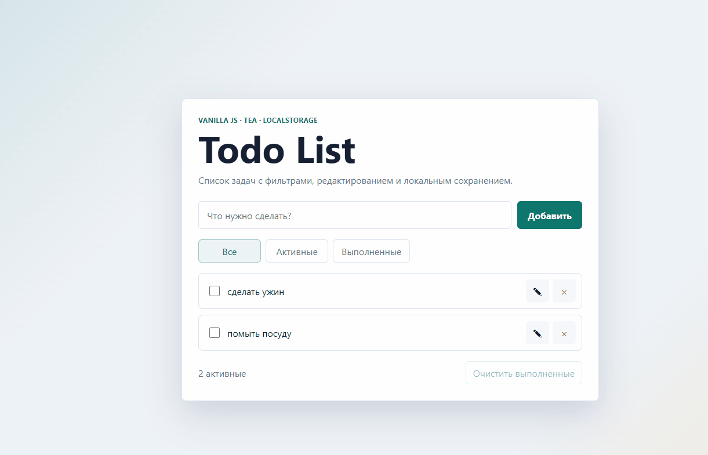

# JavaScript Todo List Tutorial

Демонстрация работы программы:


[](https://codeclimate.com/github/USERNAME/javascript-todo-list-tutorial/maintainability)

Todo List на Vanilla JavaScript, сделанный как учебный проект по веб-разработке. Приложение позволяет добавлять, редактировать, выполнять, удалять и фильтровать задачи. Состояние сохраняется в `localStorage`, поэтому список остается доступен после перезагрузки страницы. Архитектура проекта разделена на модули в стиле Elm/TEA: состояние, обновление, отображение, маршрутизация и хранение данных.
Ссылка на выбранный проект: https://github.com/dwyl/javascript-todo-list-tutorial

## Стек

- Frontend: HTML, CSS, Vanilla JavaScript
- Архитектура: Elm Architecture / TEA-подход
- Хранение данных: `localStorage`
- Тестирование: `node:test`
- Инструменты: Git, GitHub, Chrome DevTools
- Деплой: GitHub Pages, Vercel или Netlify

## Запуск локально

```bash
npm install
npm start
```

После запуска приложение будет доступно по адресу:

```text
http://localhost:4173
```

## Тесты

```bash
npm test
```

Тесты проверяют чистые функции состояния: добавление задачи, валидацию пустого ввода, переключение статуса, переименование, удаление и фильтрацию.

## Деплой

Ссылка на деплой:

```text
https://kvlwex.github.io/javascript-todo-list-tutorial/
```


## Основные функции

- создание задачи;
- редактирование названия задачи;
- отметка задачи как выполненной;
- удаление задачи;
- фильтрация задач по статусу;
- очистка выполненных задач;
- сохранение списка в браузере пользователя.
